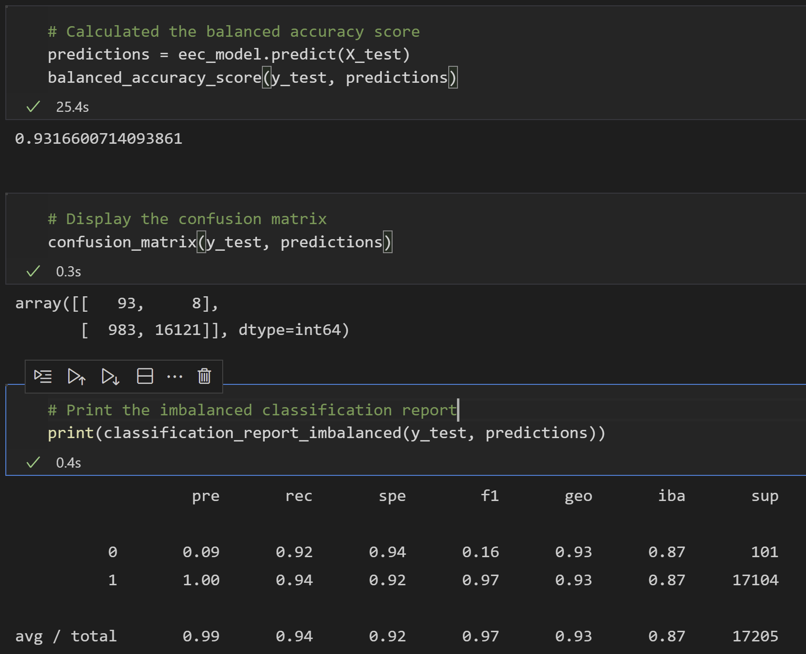

# Credit_Risk_Analysis
## Overview of Analysis
For this analysis, we used a variety of supervised machine learning algorithms to predict whether loans were "high risk" or "low risk". We ran the data through six different machine learning algorithms with the goal of finding the most effective one for our purpose. Since there are significantly more low risk loans than high risk loans, we needed to use machine learning algorithms that alleviates this class imbalance. We used oversampling, undersampling, a combination of undersampling and oversampling, as well as emsemble methods. 
## Results

### Random Oversampler
- Balanced Accuracy Score: .655
- Precision Score for High Risk: .01
- Precision Score for Low Risk: 1
- Recall/Sensitivity for High Risk: .72
- Recall/Sensitivity for Low Risk: .59
- F1/Harmonic Mean for High Risk: .02
- F1/Harmonic Mean for Low Risk: .74
- The precision on the high risk loans was really low, while the recall rate was reasonable, yet not great. The low risk loans had low recall. This information tells us that with this classifier, we would likely misidentify too many low risk loans incorrectly as high risk ones. We would catch a reasonable amount of the high risk loans, but would miss about a quarter of them. Overall, this algorithm would not be ideal for our task. It would let too many good loan opportunities slip through the cracks, while not catching enough bad ones.

### SMOTE
- Balanced Accuracy Score: .646
- Precision Score for High Risk: .01
- Precision Score for Low Risk: 1
- Recall/Sensitivity for High Risk: .60
- Recall/Sensitivity for Low Risk: .69
- F1/Harmonic Mean for High Risk: .02
- F1/Harmonic Mean for Low Risk: .81
- Smote would not be a great algorithm for our purposes either. It was less effective at recall on the bad loans, meaning more bad loans would slip through the cracks.

### Cluster Centroid
- Balanced Accuracy Score: .545
- Precision Score for High Risk: .01
- Precision Score for Low Risk: 1
- Recall/Sensitivity for High Risk: .69
- Recall/Sensitivity for Low Risk: .40
- F1/Harmonic Mean for High Risk: .01
- F1/Harmonic Mean for Low Risk: .57
This algorithm was also fairly weak, it was better than smote at detecting high risk loans, but it would have categorized too many low risk loans as high risk. It had a similar profile as the random oversampler, but was weaker.

### SMOTEEN
- Balanced Accuracy Score: .649
- Precision Score for High Risk: .01
- Precision Score for Low Risk: 1
- Recall/Sensitivity for High Risk: .72
- Recall/Sensitivity for Low Risk: .58
- F1/Harmonic Mean for High Risk: .02
- F1/Harmonic Mean for Low Risk: .73
This classifier had a profile that was nearly identical to the random classifier, but was slightly weaker. 

### Balanced Random Forest Classifier
- Balanced Accuracy Score: .788
- Precision Score for High Risk: .03
- Precision Score for Low Risk: 1
- Recall/Sensitivity for High Risk: .70
- Recall/Sensitivity for Low Risk: .84
- F1/Harmonic Mean for High Risk: .06
- F1/Harmonic Mean for Low Risk: .93
- Top 5 Importances: total_rec_prncp = .078, total_pymnt = .059, total_pymt_invoice = .056, total_rec_int = .054, last_pmt_amnt = .050
- This algorithm was more well rounded than the previous algorithms. It was a couple points weaker at detecting high risk loans than the random oversampler (.70 vs .72), but it was much better at classifying low risk loans. In banking, you do not want to take on high risk loans, but at the same time you dont want to waste a significant amount of opportunities for good loans. 

### Easy Ensemble Classifier
- Balanced Accuracy Score: .932
- Precision Score for High Risk: .09
- Precision Score for Low Risk: 1
- Recall/Sensitivity for High Risk: .92
- Recall/Sensitivity for Low Risk: .94
- F1/Harmonic Mean for High Risk: .16
- F1/Harmonic Mean for Low Risk: .97
The easy ensemble classifier was the best algoritm for our credit risk analysis. It outperformed the rest of the algorithms in every important category.

## Summary
It was clear from the results tha the "Easy Ensembly Classifier" was the best algorithm for our purposes. It was was better than its competitors across the board and could be safely recommended to use for credit risk analysis. The second best algorithm was the "Balanced Random Forest Classifier" it was a more balanced approach than the weaker algorithms. Most of the bottom tier algorithms were solid at detecting high risk loans, but they incorrectly classified too many low risk loans as high risk ones. 